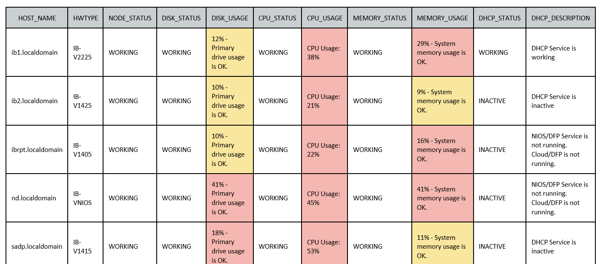

# Infoblox Status
Send Infoblox nodes status by email with thresholds using cronjob and Python.
# Requirements
 - Python >= 3.6
 - jmespath
   > pip install jmespath
 - python-dotenv
   > pip install python-dotenv
 - Edit .env file
# Screenshot
